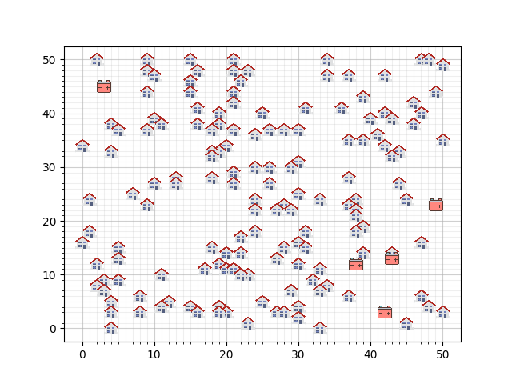

# Smart Grid

Welkom bij ons project voor het vak 'Algoritmen en Heuristieken' voor de minor programmeren aan de Universiteit van Amsterdam. Hier proberen we een onmogelijke case op te lossen. Wij hebben voor de case 'Smart Grid' gekozen.

## Case Uitleg

In de case 'Smart Grid' wordt een grid gegeven met huizen die allemaal energie kunnen leveren. Op de grid staan ook batterijen die deze energie moeten opslaan. Deze batterijen hebben wel een maximum capaciteit die niet overschreden mag worden. Om de energie van een huis naar een batterij te brengen moeten kabels worden gelegd. Deze kabels kosten geld en dus is het belangrijk om dit zo efficient mogelijk te doen. Aan ons de taak om de kosten zo laag mogelijk te houden. 

Hierbij moeten we ons aan bepaalde vereisten houden:
- Batterijen mogen niet aan elkaar verbonden zijn. Ook niet via een huis.
- Een huis mag niet aan meerdere batterijen verbonden zijn.
- Er mogen meerdere kabels over dezelfde gridsegmenten lopen.

Dit probleem heeft verschillende gradaties in moeilijkheid:
1. Alle huizen moeten een unieke kabel naar een batterij hebben.
2. Huizen mogen kabels delen.
3. Batterijen mogen verplaatst worden.
4. Je mag zelf batterijen kiezen uit een selectie en deze overal plaatsen waar je wil.

Bij elke gradatie is het doel om de kosten zo laag mogelijk te houden. De kosten kunnen berekend worden door voor elke kabel 9 te rekenen en voor elke 'normale' batterij (de batterijen van gradatie 1 t/m 3) 5000 te rekenen.

Bij de laatste gradatie kan uit de volgende batterijtypes worden gekozen met elk hun eigen prijs en capaciteit.

| **Batterijtype** | **Capaciteit** | **Prijs** |
|------------------|----------------|-----------|
| PowerStar        | 450            | 900       |
| Imerse-II        | 900            | 1350      |
| Imerse-III       | 1800           | 1800      |

Om ons algoritme te testen, zijn er drie dummy-woonwijken opgesteld. Deze zijn gegeven in csv-bestanden. Deze wijken zien er als volgt uit:



## Aan de slag

### Vereisten 

Dit project is volledig geprogrammeerd in Python. De vereiste modules kunnen geïnstalleerd worden m.b.v. het volgende command.

```bash
python3 -m pip install -r requirements.txt
```

> NOTE:
> Dit command kan per persoon verschillen afhankelijk van de installatie van python.

### Hoe te gebruiken

Het programma kan worden gerund door de main.py file te runnen. Hiervoor moeten wel nog enkele command-line arguments worden toegevoegd voordat het programma kan werken. Zo moet het eerste argument het district zijn en het tweede argument welk algoritme. Een algemeen voorbeeld is hieronder gegeven:

```bash
python3 main.py [DISTRICT] [ALGORITHM]
```

Voor `DISTRICT` kan je 1 t/m 3 invullen en voor `ALGORITHM` kan je kiezen uit een van de volgende algoritmes([hier](#algoritmes) meer info):
- baseline
- greedy
- sd_hill_climber
- baseline_shared
- greedy_shared
- hill_climber_shared
- sd_hill_climber_shared
- simulated_annealing
- plant_propagation
- hill_climber_battery
- clustering

Standaard wordt het resultaat opgeslagen in een JSON bestand te vinden op `/results/output.json`. Daarnaast wordt het ook gevisualiseerd in een matplotlib venster. Deze output methodes kunnen worden uitgeschakeld door de desbetreffende regel te commenten in regels 51 t/m 55 in main.py.

De visualisatie zou er ongeveer zo uit moeten komen te zien:


 <!--  --> -->

Om de eerdere resultaten die opgeslagen zijn een JSON bestand te visualiseren kan het volgende commando gebruikt worden:

```bash
python3 visualize_json.py [FILEPATH]
```

### Structuur

De hierop volgende lijst beschrijft de belangrijkste mappen en files in het project, en waar je ze kan vinden:

- /code: bevat alle code van dit project
    - /code/algorithms: bevat de code voor algoritmes
      - /code/algorithms/own_cables: bevat alle algoritmes voor het unieke kabel probleem
      - /code/algorithms/shared_cables: bevat alle algoritmes voor het gedeelde kabel probleem
      - /code/algorithms/battery_move: bevat alle algoritmes voor het gedeelde kabel en batterij bewegen probleem
    - /code/classes: bevat de benodigde classes voor deze case
    - /code/visualisation: bevat de code voor de visualisatie
    - /code/export: bevat de code voor het exporteren naar een JSON bestand
    - /code/helper_functions: bevat functies die in meerdere algoritmes worden gebruikt
- /data: bevat de verschillende databestanden die nodig zijn om de grid in te laden
- /docs: bevat de verslagen voor dit project
- /results: bevat de resultaten van eerdere runs geordend

## Algoritmes

Documentatie van onze algoritmes is [hier](docs/algorithms.md).

## Experimenteren

Documentatie van onze experimenten en resultaten met de verschillende algoritmes is [hier](docs/experiment.md) te vinden.

## Auteurs

- Xander Broos
- Miguel Siewe
- Sander Britton

## Credits

[Home Page](https://icons8.com/icon/103183/home-page) icon by [Icons8](https://icons8.com)

[Normal battery](https://icons8.com/icon/Vw6xKWsHOBPo/battery) icon by [Icons8](https://icons8.com)

[PowerStar battery](https://icons8.com/icon/Sy5Roz5qTmgs/battery) icon by [Icons8](https://icons8.com)

[Imerse-II battery](https://icons8.com/icon/nhowbLkfABQB/battery) icon by [Icons8](https://icons8.com)

[Imerse-III battery](https://icons8.com/icon/09kDf3bDCwgu/battery) icon by [Icons8](https://icons8.com)
