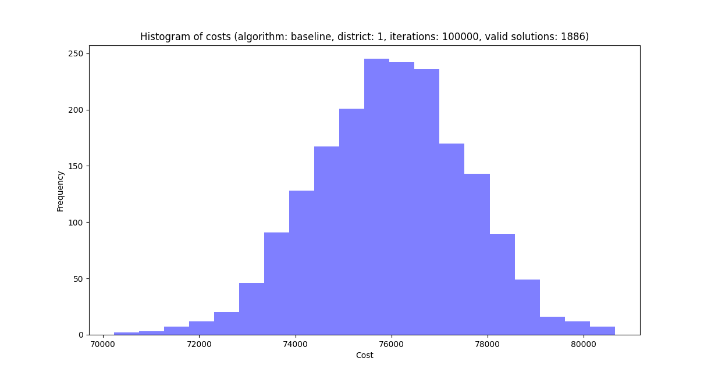
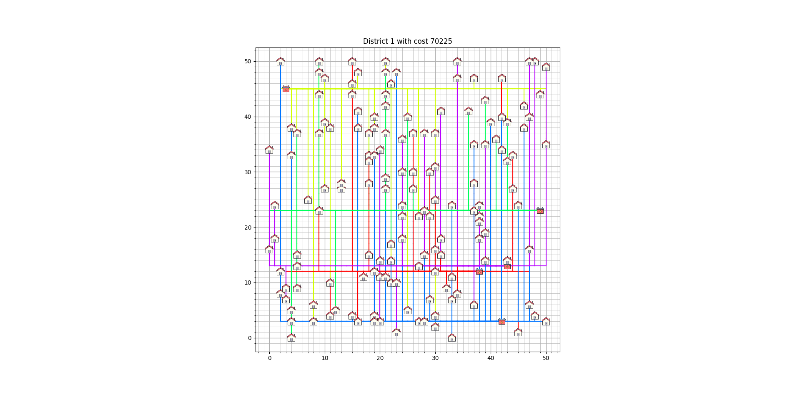

# Baseline

In dit document gaan we een baseline zetten voor de oplossing van onze case, Smart Grid. Hierin gaan we eerst de methode uitleggen en dan de resultaten geven en analyseren.

## Methode

Om een baseline te zetten voor onze algoritmes, hebben we een random algoritme gemaakt. Deze maakt random connecties tussen huizen en batterijen. Hierbij houdt het algoritme alleen rekening met het feit of een batterij wel de connectie met het huis aankan. Als dit niet zo is, wordt de connectie ook niet gemaakt. Dit wordt herhaald totdat het huis is verbonden aan een batterij, behalve als een huis aan geen enkele batterij kan worden gekoppeld. In dit geval wordt de poging gestopt. Van elke geldige oplossing wordt de cost berekend en opgeslagen. Deze worden geplot in een histogram. De beste oplossing wordt gevisualiseerd in een grid.

## Resultaten

Hier worden de resultaten gegeven voor de baseline van de drie districts.

### District 1

### District 2

### District 3

### Analyse

Alle bovenstaande histogrammen lijken redelijk op een normaalverdeling. Wij denken dat dit wél een uniforme steekproef is, want alleen de geldige oplossingen worden gebruikt, en omdat we alleen (zo goed mogelijk) random verbindingen maken, zit er nergens een bias in onze methode. De enige bias die wij kunnen bedenken, zou zijn dat computers niet écht random getallen kunnen creëeren, maar dat is verwaarloosbaar. 

Bij een vergelijking met bijvoorbeeld Rush Hour maakt het ook iets duidelijker dat er bij onze case geen sprake is van bias. Bij Rush Hour is het namelijk logisch dat sommige states niet mogelijk zijn of amper voorkomen, door de specifieke plaatsing van de auto's op het bord en hun gelimiteerde beweging. In ons geval zijn er alleen minder constraints en hebben alle connecties tussen huis en batterij dezelfde kans om voor te komen. 

Hieronder geven we een korte numerieke analyse van de histogrammen:
- District 1: de gemiddelde cost van een random oplossing is ongeveer 76000 en de cost van de beste oplossing is 70225.
- District 2: de gemiddelde cost van een random oplossing is ongeveer 68600 en de cost van de beste oplossing is 64240.
- District 3: de gemiddelde cost van een random oplossing is ongeveer 71000 en de cost van de beste oplossing is 66229.

## Conclusie

Met behulp van de resultaten uit de baseline weten we waar ons algoritme minimaal aan moet voldoen om goed te zijn. Ondertussen weten we dat zelfs de beste oplossing van vele baseline runs redelijk makkelijk te overtreffen is met een simpel algoritme. Een redelijk algoritme zou dus flink onder de baseline moeten zitten om echt goed te werken. 