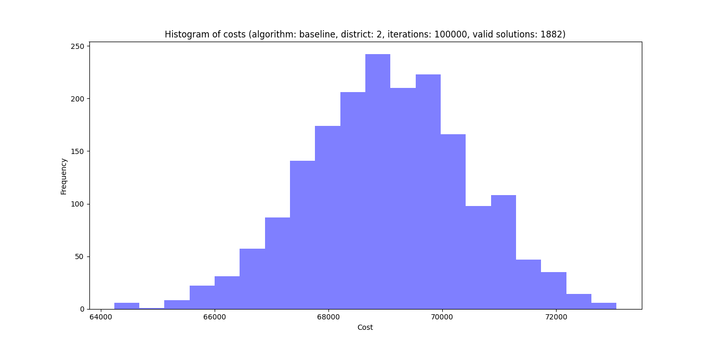
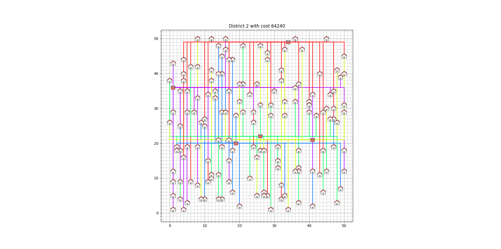

# Baseline

In dit document gaan we een baseline zetten voor de oplossing van onze case, Smart Grid. Hierin gaan we eerst de methode uitleggen en dan de resultaten geven en analyseren.

## Methode

Om een baseline te zetten voor onze algoritmes, hebben we een random algoritme gemaakt. Deze maakt random connecties tussen huizen en batterijen. Hierbij houdt het algoritme alleen rekening met of een batterij wel de connectie met het huis aankan. Als dit niet zo is, wordt de connectie ook niet gemaakt. Als een huis aan geen enkele batterij kan worden gekoppeld, wordt de poging gestopt. Van elke geldige oplossing wordt de cost berekend en opgeslagen. Deze worden geplot in een histogram. De beste oplossing wordt gevisualiseerd in een grid.

## Resultaten

Hier worden de resultaten gegeven voor de baseline van de drie districts.

### District 1

### District 2

### District 3

### Analyse

Alle bovenstaande histogrammen lijken redelijk op een normaalverdeling. 

## Conclusie

Conclusie